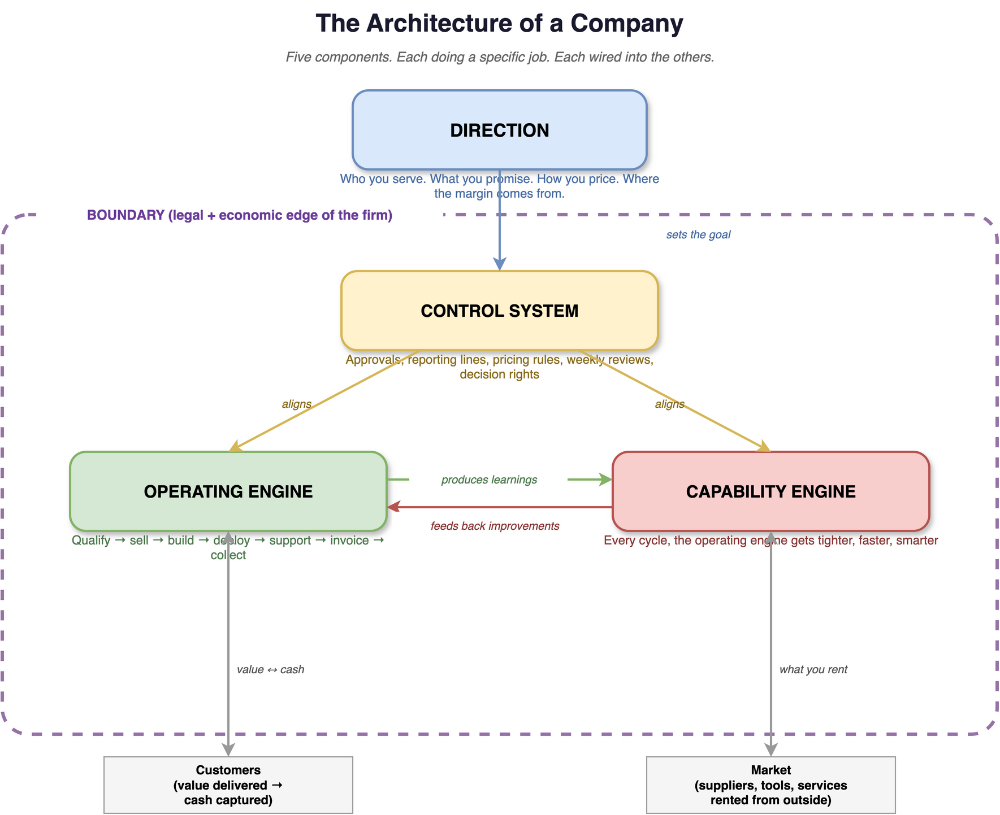

# What a Company Is and What It Does

Most founders cannot tell you what a company actually is. Ask ten of them and you get ten answers - a legal entity, a team, a product, a cap table, a brand. Each answer is partly right, but if you forgot about other aspects, you might run into trouble. This chapter gives you a single working model of what a company is, what it does, and why that matters if you plan to run one with a small team of humans and a large team of agents.

Let me introduce you to Hannah Schmidt. You will meet her many times in this book, so she is worth a page of your attention up front. Hannah is a computer scientist by training. She spent 4 years at a software agency in Munich, shipping other people's roadmaps and sitting through other people's status meetings. She was good at the job. She was also, by year 3, quietly furious.

The frustration was not about one bad project. It was about the shape of the work. Every feature took twice as long as it should have. Every decision passed through 4 people who were not the decider. Customer problems got filtered into a backlog and lost their urgency on the way there. Hannah watched competent engineers burn weeks on work that did not matter, while the work that did matter sat untouched for months. By the end of year 3 she was writing side-project specs in the evenings just to feel like something was moving.

And something else was happening in those evenings. Hannah had started playing with the new wave of AI agent tools. Claude Code, Codex, the agent frameworks shipping almost every week. She used them to prototype, to refactor, to spin up small services that would have taken a junior engineer half a week. What landed was not the novelty of the tools. It was the contrast. A side project running on 3 agents was moving faster than her 9-person team at the agency ever did. She started to wonder, half seriously at first and then not half seriously at all, whether a company built around agents from day 1 would simply skip over the coordination mess she sat inside every Tuesday.

Hannah had also, over the years alongside her job, developed a passionate hobby: sewing. She loved it. It was a real fascination with fabric, construction, and the precision behind a well-made garment. Through a friend she got to know the world of industrial sewing and tailoring machines. Large and really expensive machines that people spend a lot of money on. Machines that stitch pockets onto jeans at 3,000 stitches per minute and run production lines that cannot afford to stop. And the software running around those machines was, according to her friend and to her eye, embarrassing - fragmented, clunky, badly integrated, and held together by Excel and patience.

That was the moment the three currents collided. The frustration at the agency. The fascination with industrial sewing. And the quiet conviction that a small team with the right agents could outrun a 9-person "real" team any day of the week. Hannah could fix this. Not theoretically - literally, with her own hands and a handful of agents, if she stopped waiting for permission to build something that mattered. She sketched out what the company would look like if she built it: software for industrial sewing and tailoring machines, a small technical team, a stack of agents doing the work that a traditional agency would have scaled through hiring, and customers who would call her at 3 in the morning when a machine stopped stitching. She handed in her notice 1 month later. The agency sent flowers. Hannah started incorporating her company the same week.

That is where Hannah's story begins. The moment she left the agency, she was no longer an employee inside someone else's company. She was the one building one. She had to decide - quickly - what the word "company" actually meant. Hannah is the recurring example we will follow across this entire book. When we talk about agents, harnesses, control systems, and 100-agent fleets, she will be there, running the same company in progressively different versions of the agentic world.

Maybe you can find yourself or somebody you know in Hannah.

## What Most Founders Miss About What a Company Is About

Every entrepreneur who actually builds something has one trait in common. They understand *intrinsically* what a company is actually about. Not what the pitch decks say. Not what the startup podcasts say. Not what their MBA classmates repeat to each other at dinner. They carry an internalized, working grasp of what a company is *for* - and they act from it every single day, even if it is hard for them to put the picture into words.

At its core, a company is not only a legal wrapper around an idea. It is not only a team chasing a product. It is not exclusively a brand, a cap table, or a deck. A company is a system whose only job is to create real value for someone, deliver it reliably, and capture enough of that value to keep going and to compound over time. Everything else - the branding, the fundraising, the hiring, the strategy decks - serves that one job, or it is wasted motion.

Hannah spent her first 6 months running in circles. She chased the legal shell - company formation, tax setup, trademark, a clean set of standard contracts. All of it necessary. None of it moved the real company forward. When she signed her first customer, she realized she had optimized the wrapper and barely thought about the engine inside.

That is the cost of seeing only part of what a company is about. You do the work that feels like building, while the real building stays untouched.

## What a Company Actually Is

Here is the model I want in your head.

**A company is a bounded system organized to create, deliver, and capture value.**

Read that again. Every word is doing work.

*System.* A company is not a thing. It is a set of parts that interact. Change one part and the others respond. You cannot optimize a company by optimizing one piece.

*Bounded.* It has an edge. Inside the edge, you coordinate. Outside the edge, you transact. That edge is the reason companies exist at all. Picture running Hannah's business with no firm around it. Every engineer is a fresh contract. Every customer call is a new negotiation. Every bug fix needs a scope, a price, a signature, and a lawsuit if it breaks. The market can do all of that - in theory. In practice, the search, the haggling, the policing, the coordination cost you real money and real weeks, every single time.1 The boundary is the trick that lets you stop paying those costs for the work you do over and over again.

*Organized.* There is direction. Someone points the system toward a goal. A group without direction is not a company. It is a group with a shared email domain.

*Create, deliver, capture value.* Three verbs, not one. Most founders can do one. A few can do two. The ones who can do all three build companies that last.

That is the definition. Now you need a way to see it. A picture you can hold in your head while you make decisions.

## The Architecture of a Company

Think of a company the way an engineer thinks of a system that has an architecture. Five components, each doing a specific job, each wired into the others.

There are many ways to describe a company's architecture. Strategy textbooks do it one way. Org-design consultants do it another. Finance people slice it by balance sheet lines. None of them is wrong. The one I use in this book is chosen deliberately, because it gives you the cleanest lens for what is coming later in the book: understanding where AI agents plug in, what they can take over, and what still needs a human. Every company you will ever build, run, or advise has exactly these 5 components. You cannot skip one.

To make each component concrete, I will walk you through what it does and immediately show you what it looks like in Hannah's company. Remember: Hannah is standing at Day 1 - no customers yet, no team yet, just her, the incorporation papers, and a plan. The Hannah sketches below are what each component will look like in a few years, once the company is running. That is the picture she has to hold in her head long before she has any of it.

**Component 1 - Direction.**
What value you create, for whom, how you deliver it, and how you capture it back. Segment, promise, price, margin. If you cannot say this in 3 sentences, your direction is not yet real. Direction is not static - it develops over time.

For Hannah, this will mean selling software that modernizes industrial sewing and tailoring machines. Her target will be mid-size garment factories in Europe. Her promise will be fewer manual interventions and measurable throughput gains. Her price will be a per-machine annual license with a setup fee. Direction will take her longer to nail than she expects. In the early months, her positioning will drift between too many customer types and she will lose deals she should have won.

**Component 2 - Boundary.**
Two parts. The *legal boundary* is one entity that can sign contracts, take payments, and bear liability. The *economic boundary* is what you do inside the firm versus what you buy from the market. 

Hannah's company will be a single German GmbH. One legal counterparty for factories that want one invoice, one contract, one person to call when a machine stops stitching at 3 in the morning. That is the legal boundary doing its job. 

On the economic side, she will make a specific call early: the core machine-interface software gets built inside the firm; everything else - cloud infrastructure, CRM, accounting, design - gets purchased from the market. That is outside of the boundary of her company. That single decision will shape her gross margins more than any pricing move she makes later.

**Component 3 - Control System.**
The mechanisms that keep the company pointed the same way when people, money, and time pull sideways. Approvals, reporting lines, pricing rules, weekly operating reviews, decision rights. Not bureaucracy. Alignment infrastructure. The moment you hire a second person, the control system starts mattering, whether you design it or not.

Eventually Hannah will run a weekly operating review with her future employees every Monday. Sales commits to a weekly number. Engineering commits to a shipping target. Support reports open critical tickets. Custom deals above 50,000 EUR require her personal sign-off. These mechanisms will exist because at some point, before they exist, someone on her team will start booking custom deals that engineering cannot deliver. Revenue will look great on paper. The company will be getting weaker. That is the exact failure mode a control system prevents.

**Component 4 - Operating Engine.**
The daily machine. Leads come in. They get qualified. They get sold. The product gets built. It gets deployed. It gets supported. Invoices go out. Cash comes back. Most founders feel the company most strongly here, because this is where the week happens. Every one of those steps is a *business process* - a repeatable sequence of actions that can be modelled, traced, measured, and, increasingly, executed by agents.3

Hannah's engine will be mapped. A factory lead will get qualified in one discovery call, run through one scoped demo, close on a standard contract, deploy in 4 weeks, and transition to support by week 6. She will draw this out on a whiteboard, not because she loves process diagrams, but because a mapped engine is one you can measure, improve, and eventually hand to agents. The unmapped engine is the one that only she can run.

**Component 5 - Capability Engine.**
The part most founders miss entirely. It is the compounding component. Every quarter, does your company get better at running the operating engine? Do your onboardings get tighter? Do your deals close faster? Does support resolve issues with less handholding? A firm is not just the resources it holds - it is the productive services it can extract from those resources.2 Two companies with the same headcount, the same capital, and the same product can perform very differently because of this one component.

For Hannah, this is where her edge will actually live. After a few years and dozens of deployments across different machine families, her team will have produced a library of machine-specific quirks, integration patterns, and customer-education scripts that a new competitor cannot replicate in under 2 years without running the same deployments. A larger competitor with 4 times her funding will keep showing up in her deals. They will keep losing. Not because Hannah is smarter. Because her capability engine is denser.

Strip any of these 5 components and the company falls apart in a predictable way. No direction, the team drifts. No boundary, the market eats the margin. No control system, the incentives break. No operating engine, nothing ships. No capability engine, you stay a startup forever.

This is the company. Not a logo. Not a Notion workspace. It is a system.

Hold that picture in your head, because in the next chapter we zoom inside this system. We look at the actors who actually do the work - the agents, human and artificial. The architecture is the field. The agents are the players. One human and 100 agents is the team you will eventually field on it.

## Chapter Recap

What to take from this chapter:

- A company is not a legal entity, a team, or a product. It is a bounded system organized to create, deliver, and capture value.
- Every company has a 5-component architecture: Direction, Boundary, Control System, Operating Engine, Capability Engine. You cannot skip one.
- The weakest component is your real bottleneck - not the one that feels loudest at 9 on a Monday morning.
- The legal boundary is cheap. The economic boundary - what you do inside versus buy from the market - is what quietly decides your margin structure.
- The Capability Engine is how small companies beat bigger ones. It compounds or it does not. Nothing sits still.

**One action this week:**
Pull up a blank page. Write the 5 components down. Score your own company 1 to 10 on each one, honestly. Circle the lowest score. That is the component you work on next - not the one that is yelling the loudest.

## Endnotes

1 Ronald H. Coase (1937). *The Nature of the Firm.* Economica, New Series, Vol. 4, No. 16, pp. 386-405. [https://onlinelibrary.wiley.com/doi/10.1111/j.1468-0335.1937.tb00002.x](https://onlinelibrary.wiley.com/doi/10.1111/j.1468-0335.1937.tb00002.x). The boundary question - what firms do inside versus buy from the market - was extended into transaction-cost economics by Oliver E. Williamson, *Markets and Hierarchies: Analysis and Antitrust Implications* (New York: Free Press, 1975), and *The Economic Institutions of Capitalism* (New York: Free Press, 1985). Williamson received the Sveriges Riksbank Prize in Economic Sciences in Memory of Alfred Nobel in 2009 for this work; see the Nobel lecture at [https://www.nobelprize.org/prizes/economic-sciences/2009/williamson/lecture/](https://www.nobelprize.org/prizes/economic-sciences/2009/williamson/lecture/).

2 Edith T. Penrose (1959). *The Theory of the Growth of the Firm.* Oxford: Basil Blackwell. Fourth edition, with a new introduction by Christos N. Pitelis, Oxford University Press, 2009. [https://global.oup.com/academic/product/the-theory-of-the-growth-of-the-firm-9780199573844](https://global.oup.com/academic/product/the-theory-of-the-growth-of-the-firm-9780199573844). Penrose's central claim - that a firm is a bundle of productive services extracted from resources, rather than the resources themselves - remains foundational to the resource-based view of strategy.

3 The discipline of turning the operating engine into an explicit, measurable, executable set of processes is called Business Process Management (BPM). Its modern form traces back to Michael Hammer and James Champy, *Reengineering the Corporation: A Manifesto for Business Revolution* (New York: HarperBusiness, 1993), and was formalized as an engineering practice by Mathias Weske, *Business Process Management: Concepts, Languages, Architectures,* third edition (Berlin: Springer, 2019), [https://link.springer.com/book/10.1007/978-3-662-59432-2](https://link.springer.com/book/10.1007/978-3-662-59432-2). The industry-standard modelling notation is BPMN 2.0, maintained by the Object Management Group: *Business Process Model and Notation (BPMN), Version 2.0.2* (OMG, 2013), [https://www.omg.org/spec/BPMN/2.0.2/](https://www.omg.org/spec/BPMN/2.0.2/). Treat every arrow on the architecture diagram in this chapter as a process that can, in principle, be drawn in BPMN, instrumented, and - when the time comes - handed to agents.

## Sources

- [wiki/chapters/what-a-company-is-and-what-it-does.md](../../wiki/chapters/what-a-company-is-and-what-it-does.md)
- [wiki/concepts/company/what-a-company-actually-is/](../../wiki/concepts/company/what-a-company-actually-is/)
- [wiki/concepts/company/what-a-company-does/](../../wiki/concepts/company/what-a-company-does/)
- [wiki/concepts/company/how-a-company-is-built/](../../wiki/concepts/company/how-a-company-is-built/)

## Last Updated

2026-04-19
