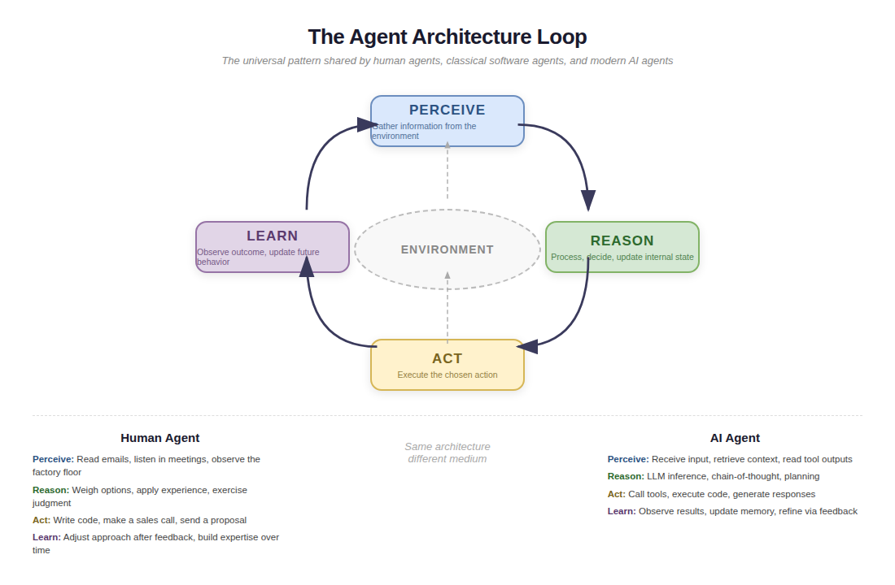

# What an Agent Is

This chapter introduces the concept of the agent as the fundamental unit of work — in any company, in any era. The core move: show the reader that human agents and AI agents are not different species. They are different implementations of the same architecture. Then use that insight to unlock a practical transfer: the management frameworks you already use for human agents work for AI agents too, with adjustments.

## Sections

### Chapter Purpose

The first chapter established what a company is — a bounded system organized to create, deliver, and capture value. This chapter zooms in on the actors inside that system. Every company runs on agents: people authorized to act on behalf of the organization, making decisions, executing tasks, and pursuing goals within their delegated scope. The reader needs to understand agents as a general concept before we can argue that AI agents are about to join the workforce as a new kind of colleague.

The chapter should leave the reader thinking: "I already know how to manage agents. I have been doing it my entire career. AI agents are a new medium, not a new discipline."

### Core Argument

The word "agent" means the same thing in business, in law, in computer science, and in AI: an entity that acts on behalf of a principal to achieve goals in an environment. This is not a loose analogy. It is a structural description. Human agents and AI agents share the same perception-reasoning-action loop, face the same principal-agent problem, and require the same management mechanisms — delegation, authority boundaries, monitoring, escalation, trust progression. The management frameworks companies have built for human agents are directly transferable to AI agents.

### Narrative Device

Continue with Hannah Schmidt. Her company has grown from the founding moment in Chapter 1. She now has her first hires — Lukas, a software developer who writes the machine integration code, and Marco, a sales rep who sells the software to textile manufacturers. Both of them are agents acting on Hannah's behalf. The chapter uses Hannah's real management challenges with these two very different agents to introduce the concept of agency, then shows how the same challenges appear when she starts deploying AI agents.

### Proposed Flow

#### Part 1: Definition — What Is an Agent?

Open by observing that Hannah now has a company with people in it. She is no longer the one doing all the work. She delegates. That makes her a principal. And every person she delegates to is an agent.

**Hannah's human agents — the programmer and the sales guy:**

Start with Lukas, Hannah's first developer. Hannah cannot write all the machine integration code herself anymore. She hires Lukas and hands him a piece of the product: build the interface layer between their software and a new generation of Juki industrial sewing machines. She gives him a scope (the Juki integration module), context (the existing codebase, the machine protocol documentation, the customer requirements), authority (he can make architectural decisions within the module, but changes to the shared API need her sign-off), and goals (a working integration that passes the test suite and ships by end of quarter). Lukas reads the machine specs (perceives), designs an approach and makes trade-offs about which edge cases to handle (reasons), writes and tests the code (acts), and improves his approach after each code review and customer deployment (learns). He is an agent — situated in the codebase and the product context, acting autonomously within boundaries, pursuing goals on Hannah's behalf.

Then there is Marco, the sales rep. Hannah needs someone talking to textile manufacturers while she focuses on product. She hires Marco and gives him a territory (mid-size garment factories in southern Germany), context (the product, the pricing tiers, which customer profiles get the most value), authority (he can offer standard pricing and schedule demos, but custom deals above a threshold need Hannah's approval), and goals (build a qualified pipeline and close three customers this quarter). Marco reads the market, listens to what factory managers complain about (perceives), figures out which prospects are a real fit and which are tire-kickers (reasons), runs demos, writes proposals, follows up (acts), and adjusts his pitch based on what objections keep coming up (learns). He is an agent too — situated in the market, acting autonomously within boundaries, pursuing goals on Hannah's behalf.

Two very different people, two very different jobs. But the same structure.

Then introduce the formal definition: an agent is an entity that perceives its environment, reasons about what to do, acts to achieve goals on behalf of a principal, and learns from outcomes. Show this is the same definition Russell and Norvig gave in 1995, Wooldridge and Jennings formalized the same year, and every major AI company restates today. Name the key researchers. The definition has been stable for thirty years because it describes a real structural pattern.

**Hannah's AI agent example — a walk through the loop:** Six months later, Hannah deploys an AI support agent to handle first-level configuration inquiries on her industrial sewing software. A customer writes in: *"Our Juki MF-7900 is skipping stitches after the last firmware update. Anything we can do?"* Now watch what the agent actually does, one turn of the loop at a time.

**Perceive.** The harness receives the message and assembles the agent's view of the world: the customer's identity and plan tier, recent tickets on this machine, the current firmware version, and the MF-7900 section of the product documentation retrieved from a vector store. None of this is magic — it is just the agent's senses. Reading the inbound message, pulling the customer record via a CRM tool call, fetching the service history, retrieving the relevant documentation. The LLM sees the composed picture in its context window.

**Reason.** The model produces a reasoning trace: *the complaint is mechanical-sounding (skipped stitches), but the trigger was a firmware update, which points to a software regression rather than a hardware issue. Known issue? Let me check.* The agent decides it needs more information before responding and selects the next action. This is the "Thought" step in the classical ReAct pattern. The reasoning is visible — you can read it in the logs later.

**Act.** The agent calls a tool: `search_known_issues(machine="MF-7900", firmware="4.2.1")`. The tool returns a match: a documented regression in that firmware release, with a recommended rollback procedure. The agent now has what it needs. It drafts a response for the customer with the rollback steps, cites the internal issue reference, and offers to schedule a technician if the rollback does not resolve the problem. Before sending, it checks its guardrails: is this within scope? (yes, configuration and firmware.) Is confidence above the threshold? (yes.) Does anything require escalation? (no.) The response goes out. The ticket is closed with a note attached to the customer's record.

**Learn.** That run leaves a trail. The full reasoning trace, every tool call, and the final response are logged. A human spot-checks one in every ten tickets. The customer's satisfaction rating flows back into an evaluation dataset. When a pattern emerges — say, the agent is misdiagnosing a specific error code — Hannah updates the system prompt, adds a few-shot example, or extends the knowledge base. The agent itself does not learn in the neural-network sense between runs. The *system around the agent* learns, and the agent's behavior changes because its context and instructions change.

That full cycle — perceive, reason, act, learn — is what an LLM agent in the loop actually does. It is not a metaphor. It is a runtime loop: context assembly, model inference, tool execution, state update, evaluation. Every turn. Every ticket. Thousands of times a day.

Scope, authority, context, and goals are all explicit: scope (configuration questions only), authority (can answer and close standard tickets, access product docs and customer history; cannot touch billing, cannot promise features), context (product docs, past tickets, customer record), goals (resolve accurately, escalate when unsure, never fabricate features).

The punchline: Lukas, Marco, and the support agent are all running on the same architecture. Perception-reasoning-action-learn. Delegated authority within boundaries. Goals set by the principal. The medium is different. The structure is identical.

Brief tour of definitions — show the consensus across:
- **Classical CS:** Russell & Norvig (perceive-act), Wooldridge (autonomy, reactivity, proactiveness, social ability), Franklin & Graesser (situated, senses, acts, pursues agenda)
- **Industry:** Anthropic (LLM that dynamically directs its own processes), OpenAI (independently accomplishes tasks on your behalf), Google (pursues goals with reasoning, planning, memory, autonomy)
- **Business/law:** A person authorized to act on behalf of a principal, bound by fiduciary duty

The key insight: every definition converges on the same five properties — perceive, reason, act, pursue goals, adapt. These properties describe a human sales rep and an LLM customer service agent with equal accuracy.

Mention the BDI architecture (Bratman → Rao & Georgeff) as the strongest bridge: it was explicitly derived from a theory of how humans reason (beliefs, desires, intentions), then formalized into software agent design. The architecture of agency was always shared.

#### Part 2: Deep Dive — The Economics of Agency

Transition: if human agents and AI agents share the same architecture, do they also share the same problems? Yes. The biggest one has a name: the principal-agent problem.

Introduce Jensen and Meckling (1976). A firm is a nexus of contracts. Every delegation relationship generates **agency costs** — the unavoidable price of getting someone else to do work on your behalf. Three types:

**1. Monitoring costs** — what the principal spends to observe and control the agent's behavior.

*Hannah's example:* Hannah cannot stand behind Lukas watching every line of code he writes, and she cannot sit in on every sales call Marco makes. So she invests in monitoring. For Lukas: code reviews, pull request approvals on anything touching the shared API, a weekly technical sync where he walks her through progress and blockers. For Marco: a CRM she checks weekly, a pipeline review every Monday, and ride-alongs on customer demos once a month to see how he actually positions the product. All of this costs time, attention, and money. It is the price she pays for not doing the work herself.

*AI parallel:* When Hannah deploys the AI support agent, she builds an evaluation dashboard — ticket resolution rate, customer satisfaction, escalation frequency, hallucination checks on a random sample of responses. She sets up automated quality checks that flag responses below a confidence threshold. She reviews flagged tickets weekly. Monitoring costs do not disappear with AI agents. They change form — from management conversations to evaluation pipelines. In some ways they get cheaper (you can log every interaction). In other ways they get harder (the agent operates too fast for real-time human review).

**2. Bonding costs** — what the agent spends to assure the principal they will act faithfully.

*Hannah's example:* Lukas writes clean commit messages, documents his architectural decisions, and proactively flags technical debt before it becomes a crisis. He does this not because Hannah forces him to, but because he wants her to trust his judgment on bigger decisions. Marco sends Hannah a weekly pipeline update before she asks for one. He flags deals that feel off even when they would inflate his numbers. He turns down a prospect that does not fit the product rather than closing a bad deal that will blow up in implementation. These are bonding costs — Lukas and Marco invest effort in making their work visible and trustworthy, even when that effort does not directly produce output.

*AI parallel:* The AI agent's bonding costs are structural rather than behavioral. They are built into the system by design: chain-of-thought reasoning traces that show the agent's logic, tool call logs that document every action, confidence scores on every response, explicit citation of sources. Constitutional AI training and RLHF are, in a sense, massive upfront bonding investments — teaching the agent to behave in ways that build the principal's trust. The agent cannot choose to be transparent the way Lukas or Marco can. But the system can be designed to make transparency the default.

**3. Residual loss** — the unavoidable gap between the agent's actions and what would maximize the principal's welfare.

*Hannah's example:* Even with monitoring and bonding, Lukas and Marco will sometimes make decisions that are not exactly what Hannah would have chosen. Lukas over-engineers a module that Hannah would have shipped simpler. He spends two days on an elegant abstraction when a straightforward implementation would have been fine. Marco offers a discount to close a deal faster when Hannah would have held the price and let the prospect walk. He prioritizes a large prospect that looks impressive on paper but would require heavy customization that does not fit the roadmap. None of this is malice or incompetence. It is the structural reality that Lukas is not Hannah and Marco is not Hannah. They have different judgment, different information, different instincts. The gap between what they do and what Hannah would have done is residual loss. It can never be zero.

*AI parallel:* The AI support agent resolves tickets differently than Hannah would. It phrases responses in ways she would not choose. It escalates some tickets she would have handled, and handles some she would have escalated. It occasionally hallucinates a product feature that does not exist. Residual loss with AI agents takes different forms — hallucination, sycophancy, specification gaming, reward hacking — but the fundamental reality is the same: the agent is not the principal, and the gap between their actions can never be fully closed.

Close Part 2 with the strategic insight: agency costs cannot be eliminated. They can only be managed. That is true for human agents and AI agents alike. The entire history of management — incentive design, governance, reporting, culture-building — is a set of technologies for managing agency costs. The question for the AI era is not whether agency costs exist with AI agents (they do), but whether the tools for managing them transfer.

#### Part 3: Managing Agents — The Transfer Playbook

Transition: the principal-agent framework tells us the problems are the same. Now let us look at the solutions. Companies have spent decades building management practices for human agents. How well do they transfer to AI agents?

Walk through each practice with Hannah as the illustration, showing both the human and AI version side by side. This section should be the most detailed and practical part of the chapter.

**1. Onboarding**

Hannah onboards Lukas: walkthrough of the codebase, the architecture, the deployment pipeline, the coding standards. A week of pair programming with Hannah on a small feature. A 90-day probationary period where she reviews every pull request before it merges. Hannah onboards Marco: deep-dive on the product, the customer segments, the competitive landscape, the pricing logic. He shadows Hannah on three sales calls. A 90-day ramp where she joins every customer meeting and debriefs afterward.

Hannah onboards the AI support agent: system prompt with company context, product documentation, tone guidelines, and behavioral rules. Few-shot examples of good and bad responses. A staging environment where the agent handles simulated tickets before going live. A 30-day evaluation period with human review of every fifth response.

The function is identical. The medium changed from social to technical.

**2. Delegation**

Hannah delegates to Lukas: clear task description ("build the Juki machine integration module"), expected outcomes ("passes the test suite, handles the five most common machine configurations, ships by end of Q2"), context on why it matters ("three customers are waiting on Juki support; this unlocks the whole Japanese machine segment"), and an escalation trigger ("if you need to change the shared API or if you hit a protocol issue you cannot resolve in a day, come to me").

Hannah delegates to Marco: clear territory ("mid-size garment factories in southern Germany"), expected outcomes ("three closed customers this quarter, pipeline of at least ten qualified prospects"), context ("focus on factories already running modern machines — they get the most value fastest"), and an escalation trigger ("if a prospect wants custom pricing or asks for a feature we do not have, loop me in before you commit to anything").

Hannah delegates to the AI agent: structured prompt ("handle customer configuration questions"), success criteria ("resolve accurately within company policy"), background context in the knowledge base, and programmatic escalation rules ("if confidence below 0.7 or topic is billing/hardware, hand off to human").

Same structure. Same logic. Different interface.

**3. Authority Boundaries**

Hannah defines Lukas's authority: he can make architectural decisions within his module, he can refactor code he owns, he cannot change the shared API without her approval, he cannot deploy to production without passing the test suite and her sign-off.

Hannah defines Marco's authority: he can offer standard pricing, schedule demos, and negotiate within the published discount bands. He cannot approve custom deals, commit to roadmap features, or promise delivery dates without checking with Hannah.

Hannah defines the AI agent's authority: it can answer configuration questions and close tickets, it can access the product documentation and customer history, it cannot access billing data, it cannot promise features, it cannot override escalation triggers.

The concept is identical. With AI agents it must be more explicit because they lack the social intuition that helps humans infer unstated boundaries.

**4. Monitoring and Feedback**

Hannah monitors Lukas: code reviews on every pull request, a weekly technical sync, and a quarterly conversation about his growth and the codebase direction. Hannah monitors Marco: weekly pipeline review in the CRM, monthly ride-alongs on customer demos, and quarterly review of win/loss patterns.

Hannah monitors the AI agent: real-time dashboard (resolution rate, satisfaction, escalation rate), automated quality checks, weekly review of flagged responses, monthly evaluation against a curated test set.

The shift: from periodic human judgment to continuous automated evaluation. But the purpose is the same — verify the agent is performing, catch problems early, course-correct.

**5. Trust Progression**

Hannah trusts Lukas progressively: pair programming → reviewed pull requests → self-merged on his module → eventually trusted with architectural decisions and mentoring a junior developer.

Hannah trusts Marco progressively: shadowing her calls → running demos with her in the room → solo demos → eventually trusted with the largest accounts and pricing flexibility.

Hannah trusts the AI agent progressively: staging environment only → live with human review of every response → live with spot-check review → live with automated monitoring only → expanded to handle more complex ticket types.

The principle is universal: grant autonomy proportional to demonstrated competence. Start tight, expand as trust is earned.

**6. Escalation**

Hannah tells Lukas: "Come to me if you need to change the shared API, if you hit a bug you cannot explain, or if a customer reports something you have not seen before."

Hannah tells Marco: "Come to me if the customer wants something outside standard pricing, if they push for a feature commitment, or if a deal feels off even if the numbers look good."

Hannah configures the AI agent: "Escalate to human if confidence is below threshold, if the query involves billing or hardware, or if the customer expresses frustration."

The logic is the same. The implementation shifts from judgment-based ("if a deal feels off") to rule-based ("if confidence below 0.7"), though modern AI agents are increasingly capable of judgment-like escalation decisions.

**What needs adjustment:** Speed mismatch (management at machine speed), absence of social norms (everything must be explicit), replicability (one configuration, many instances).

**What breaks:** Intrinsic motivation (you cannot appeal to an AI agent's career ambitions), social accountability (no peer pressure), informal knowledge transfer (no water cooler), ethical intuition in novel situations (explicit principles needed).

Close the chapter with the central claim: you are not entering a new discipline when you start managing AI agents. You are extending an existing one. The principal-agent problem is the same. The delegation challenge is the same. The trust-building process is the same. What changes is the speed, the scale, and the need for explicit specification. The entrepreneur who has built and managed a team of 10 people has practiced the core skills needed to orchestrate a fleet of AI agents.

### Draft Location

- outputs/manuscript/what-an-agent-is-draft.md (to be created)

### Related Pages

- [Agents — Hub Page](../concepts/agents/index.md)
- [What an Agent Is](../concepts/agents/what-an-agent-is/index.md)
- [Classical CS Agent Definitions](../concepts/agents/what-an-agent-is/classical-cs-agent-definitions.md)
- [The BDI Architecture](../concepts/agents/what-an-agent-is/bdi-architecture.md)
- [Industry AI Agent Definitions](../concepts/agents/what-an-agent-is/industry-ai-agent-definitions.md)
- [The Human Agent](../concepts/agents/what-an-agent-is/human-agent-definition.md)
- [Human Agents and AI Agents](../concepts/agents/human-agents-and-ai-agents/index.md)
- [Principal-Agent Theory and AI](../concepts/agents/human-agents-and-ai-agents/principal-agent-theory-and-ai.md)
- [Transferring Work Models](../concepts/agents/human-agents-and-ai-agents/transferring-work-models.md)
- [Jensen and Meckling on the Firm](../concepts/company/what-a-company-actually-is/jensen-and-meckling-on-the-firm.md)
- [Governance, Control, and Incentives](../concepts/company/how-a-company-is-built/governance-control-and-incentives.md)

### Deferred to Next Chapter

Agent architectures (classical and modern), the perception-reasoning-action loop in technical depth, multi-agent systems, and organizational design patterns for agent coordination are reserved for the next chapter.

## Sources

- [raw/research/2026-04-16-agent-definitions-research.md](../../raw/research/2026-04-16-agent-definitions-research.md)

## Last Updated

2026-04-17
