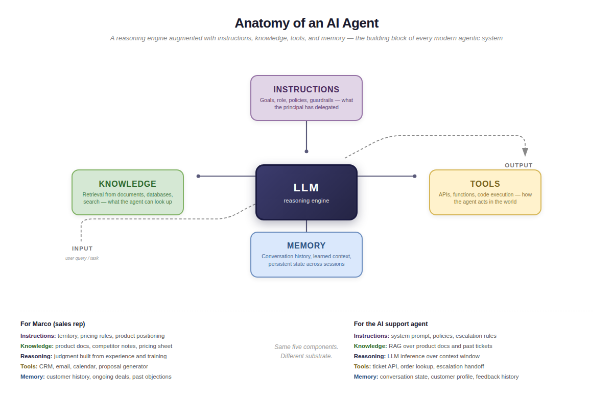

# Modern LLM Agent Architectures

Large language models changed what is possible with agents, but they did not change the fundamental architecture. Modern LLM agents still perceive, reason, act, and learn. What changed is the reasoning engine — from hand-coded logic and formal planners to general-purpose language models that can handle ambiguity, incomplete instructions, and novel situations. This section maps the new patterns and shows where they fit in the design space that Russell, Wooldridge, and the BDI researchers charted decades ago.

The diagram above shows the foundational building block Anthropic calls the **augmented LLM** — a reasoning engine (the LLM) wrapped with four capabilities: **instructions** (what the principal has delegated), **knowledge** (what can be retrieved), **tools** (how the agent acts), and **memory** (what persists across interactions). Every modern agentic system, from a simple chatbot to a fully autonomous agent, is built by composing this block. See Anthropic's [Building Effective Agents](https://www.anthropic.com/engineering/building-effective-agents) for the original formulation.

## Sections

### Core Idea

Modern LLM agent architectures organize around three innovations: (1) the LLM as a general-purpose **reasoning engine** that replaces hand-coded logic, (2) **tool use** as the standard mechanism for agents to act in the environment, and (3) **orchestration patterns** that range from simple chains to fully autonomous loops. The key frameworks — ReAct, Anthropic's building-block patterns, LangChain's cognitive architecture spectrum, and Wang et al.'s four-module architecture — are all variations on the classical perception-reasoning-action loop, implemented with language models instead of rule engines.

### Details

#### The ReAct Pattern (Yao et al., 2022)

ReAct — **Reasoning + Acting** — interleaves reasoning traces and task-specific actions at each step. Before taking an action, the agent articulates *why* (a "thought") and then decides *what to do* (an action). The result is observed, and the cycle repeats.

The pattern:
1. **Thought** — reason about the current situation, decompose the problem, track progress
2. **Action** — call a tool, search for information, execute code
3. **Observation** — receive the result of the action
4. (Loop back to Thought)

ReAct was the first widely adopted pattern for LLM agents. On benchmarks like HotpotQA and Fever, it overcame hallucination and error propagation common in pure chain-of-thought reasoning. On decision-making benchmarks (ALFWorld, WebShop), it outperformed imitation learning and reinforcement learning by 34% and 10% absolute success rate.

**Connection to classical architecture:** ReAct is a direct implementation of the perception-reasoning-action loop with an explicit reasoning trace. The "thought" step corresponds to the reasoning phase; the "action" step corresponds to the action phase; the "observation" step corresponds to the perception phase of the next cycle.

#### Tool Use and Function Calling

Tool use is the mechanism that transforms LLMs from text generators into agents. An LLM that can only generate text is a model. An LLM that can call tools — search the web, query a database, run code, send emails — is an agent.

The standard interface: the LLM generates a structured tool call (typically JSON), the system executes it, and the result feeds back into the LLM's context for the next reasoning step.

Key developments:
- **Function calling APIs** (OpenAI, Anthropic, Google) standardized the interface between LLMs and tools
- **Model Context Protocol (MCP)** — introduced by Anthropic in November 2024 — is an effort to standardize the interface between tool providers and LLM agents, analogous to USB for peripherals
- **Skill engineering** (2025) — bundling instructions, workflows, scripts, and documentation into higher-order abstractions beyond individual tool calls

Three approaches to tool use:
1. **Fine-tuning** — train the model to use specific tools (Toolformer, Gorilla)
2. **In-context learning** — describe tools in the prompt and let the model figure out how to use them (dominant approach)
3. **Orchestration frameworks** — external systems manage tool routing (HuggingGPT, LangChain)

**Connection to classical architecture:** Tools are actuators. In Russell and Norvig's framework, actuators are how agents affect their environment. Tool calling is the modern implementation of the actuator interface.

#### Anthropic's Building-Block Patterns (2024)

Anthropic's "Building Effective Agents" describes a progression from simple to complex:

1. **Augmented LLM** — the foundational building block: an LLM enhanced with retrieval, tools, and memory
2. **Prompt Chaining** — task decomposed into sequential LLM calls, each processing the output of the previous one
3. **Routing** — an initial LLM call classifies the input and decides which downstream model or path to use
4. **Parallelization** — subtasks run simultaneously for speed or multi-perspective confidence
5. **Orchestrator-Workers** — a central LLM dynamically breaks down tasks, delegates to worker LLMs, and synthesizes results
6. **Evaluator-Optimizer** — one LLM generates a response; another evaluates and provides feedback in a refinement loop
7. **Autonomous Agent** — the LLM dynamically directs its own processes and tool usage in an open-ended loop

The design principle: "Find the simplest solution possible, and only increase complexity when needed." Most production systems use patterns 1–4. Patterns 5–7 are reserved for genuinely complex, open-ended tasks.

**Connection to classical architecture:** This progression maps onto the AIMA hierarchy. Prompt chaining and routing correspond to reflex agents with more sophisticated condition-action logic. Orchestrator-workers correspond to goal-based agents. Evaluator-optimizer corresponds to the learning agent's critic component. Autonomous agents correspond to the full learning agent architecture.

#### Wang et al.'s Four-Module Architecture (2023)

The first comprehensive survey of LLM-based autonomous agents proposed a four-module architecture:

1. **Profile module** — defines the agent's role and persona (implemented as the system prompt)
2. **Memory module** — stores and retrieves past experiences (short-term context window + long-term external storage)
3. **Planning module** — decomposes complex tasks, reflects on progress, and adjusts plans
4. **Action module** — executes actions in the environment using tools

The profiling module influences how memory and planning operate; all three internal modules feed into the action module.

**Connection to classical architecture:** This maps directly onto the BDI model. Profile = the agent's "character" (framing beliefs and desires). Memory = beliefs (knowledge about the world). Planning = the deliberation process that generates intentions. Action = intention execution. The vocabulary changed; the architecture did not.

#### LangChain's Cognitive Architecture Spectrum (2024)

LangChain introduced "cognitive architecture" as a concept — how a system processes inputs and generates outputs through a structured flow of code, prompts, and LLM calls. They define a spectrum:

1. **Hardcoded** — all logic predetermined, no LLM reasoning
2. **Single LLM call** — one model call with pre/post-processing
3. **Chain** — sequential LLM calls, each building on the previous
4. **Router** — LLM decides which path to take
5. **Autonomous agent** — the system itself decides what steps are available, what tools to use, and when to stop

The key insight: "The word 'cognitive' is used because agentic systems rely on using an LLM to reason about what to do, while 'architecture' is used because these agentic systems still involve a good amount of engineering similar to traditional system architecture."

#### The Autonomy Spectrum

Multiple frameworks (Gartner, Kore.ai, Turian, LangChain) converge on a five-level hierarchy of agent autonomy:

| Level | Description | Human Parallel |
|-------|-------------|----------------|
| 1 — Reactive | Pre-configured responses, no reasoning | Call center script |
| 2 — Task-Specific | Executes narrow tasks with human triggers | Junior employee following procedures |
| 3 — Constrained Autonomy | Creates plans, executes, reflects on success | Project manager with clear mandate |
| 4 — Guided Autonomy | Self-improves, connects to new resources | Senior manager expanding scope |
| 5 — Full Autonomy | Operates independently within domain | Domain expert with full authority |

Gartner (2025): only 15% of IT leaders were considering, piloting, or deploying fully autonomous agents. Gartner predicts 40% of enterprise applications will embed task-specific agents (Level 2–3) by end of 2026.

Andrew Ng's key finding: even weaker models wrapped in agentic workflows (Level 3–4) can outperform stronger models used in single-shot style (Level 2). Architecture matters more than raw model capability.

### Source Links

- [Yao, S. et al. (2022). ReAct: Synergizing Reasoning and Acting in Language Models — arXiv](https://arxiv.org/abs/2210.03629)
- [Google Research: ReAct Blog Post](https://research.google/blog/react-synergizing-reasoning-and-acting-in-language-models/)
- [Anthropic: Building Effective Agents](https://www.anthropic.com/research/building-effective-agents)
- [Wang, L. et al. (2023). A Survey on Large Language Model based Autonomous Agents — arXiv](https://arxiv.org/abs/2308.11432)
- [LangChain: What Is a Cognitive Architecture?](https://blog.langchain.com/what-is-a-cognitive-architecture/)
- [The Road to Fully Autonomous AI — Turian](https://www.turian.ai/blog/the-5-levels-of-ai-autonomy)
- [Five Levels of AI Agents — Kore.ai](https://www.kore.ai/blog/five-levels-of-ai-agents)
- [Prompt Engineering Guide: Function Calling in AI Agents](https://www.promptingguide.ai/agents/function-calling)

### Why It Matters

Modern LLM agent architectures are not a break from the classical agent tradition — they are a continuation of it, with a dramatically more powerful reasoning engine. The perception-reasoning-action loop is still the universal pattern. The BDI structure is still the internal architecture. The AIMA hierarchy still describes the design space.

What LLMs changed is the **flexibility** of the reasoning phase. Classical agents required hand-coded logic for every decision. LLM agents can handle novel situations, incomplete instructions, and ambiguous goals — much like a human agent can. This is what makes the human-AI agent parallel so actionable: LLM agents are finally flexible enough to be managed the way you manage people.

The autonomy spectrum also maps directly onto management practice. You do not give a new hire full autonomy on day one. You start them with scripts (Level 1), graduate them to defined tasks (Level 2), give them projects with clear goals (Level 3), expand their scope as they prove themselves (Level 4), and eventually trust them as domain experts (Level 5). The same progression applies to AI agents — and the management mechanisms at each level are transferable.

### Related Pages

- [The Perception-Reasoning-Action Loop](perception-reasoning-action-loop.md)
- [Classical Agent Architectures](classical-agent-architectures.md)
- [Multi-Agent Systems](multi-agent-systems.md)
- [Industry AI Agent Definitions](../what-an-agent-is/industry-ai-agent-definitions.md)
- [Transferring Work Models](../human-agents-and-ai-agents/transferring-work-models.md)

## Sources

- [raw/research/2026-04-16-agent-definitions-research.md](../../../../raw/research/2026-04-16-agent-definitions-research.md)

## Last Updated

2026-04-16
